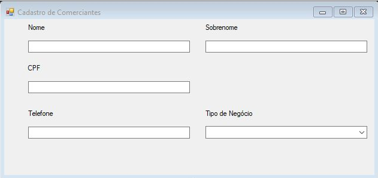
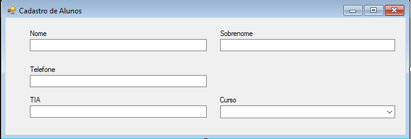

# Documento de Visão do Projeto "MacCupons"

Este documento apresenta uma solução de software para o projeto *"MacCupons"*, solicitado pelo cliente *"MacFriends S.A"*, 
apresentando os problemas a serem solucionados, as necessidades dos principais envolvidos, o alcance do projeto e as funcionalidades 
esperadas do sistema.

## Objetivos

* Catalogar produtos de comerciantes da redondeza e disponibilizar para alunos da Universidade Presbiteriana Mackenzie, aumentando a rotatividade e lucro dos comerciantes;
* Sistema de descontos para alunos que utilizarem com frequência o sistema, potencializando vendas e lucro;
* Facilitar o conhecimento de comercios novos/existentes em torno da Universidade Presbiteriana Mackenzie, facilitando o acesso e o conhecimento aos alunos/professores.

## Problema

* Descrição do problema: Desconhecimento por boa parte dos alunos da Universidade Presbiteriana Mackenzie de todos os produtos que podem ser adquiridos por comerciantes informais na redondeza. Dificuldade na relação cliente-vendedor por desconfiança ou desconhecimento.
* Quem é afetado pelo problema: Comerciantes e alunos/professores;
* Impacto no negócio: Baixa confiança entre os afetados pelo problema, causando número menor de vendas e rendimento financeiro, pois o aluno/professor pode não conhecer o local para futuras compras;
* Benefícios de uma boa solução: Maior rotatividade de produtos e aumento considerável de vendas. Melhoria na relação comerciante-consumidor.
## Definições, abreviações e outros termos do domínio do problema

* Facilitar a descobertar de novos comercios;
* Ajudar os comerciantes locais;
* Ajudar a relação comercio/cliente;
* Facilitar a vida do aluno/professor.

## Integração com outros sistemas

* Google Maps;
* Facebook;
* Instagram.

 
## Interessados

* Alunos/professores;
* Comerciantes locais;
* Patrocinadores.

## Usuários

* Alunos da Universidade Presbiteriana Mackenzie (Campus Higienopolis);
* Professores da Universidade Presbiteriana Mackenzie (Campus Higienopolis);
* Comerciantes.

## Funcionalidades do produto

* Cadastro de Alunos;
* Cadastro de professores;
* Cadastro de Comerciantes;
* Cadastro de descontos;
* Cadastro de Restaurantes.

## Restrições do projeto

* Apenas comerciantes que atuem na região próxima á Universidade Presbiteriana Mackenzie (Campus Higienopolis);
* Apenas alunos/professores da Universidade Presbiteriana Mackenzie;
* Necessário conexão à internet para retirada do cupom,
* Necessário o TIA (Terminal Informativo Academico) para a retirada do cupom e a carteirinha (TIA) para a validação do cupom.

## Protótipos de tela

### Protótipos para funcionalidade 1

Fonte: Exemplos gerados pelo assistente do **Enterprise Architect**.

### Protótipos para funcionalidade 2

Fonte: Exemplos gerados pelo assistente do **Enterprise Architect**.

