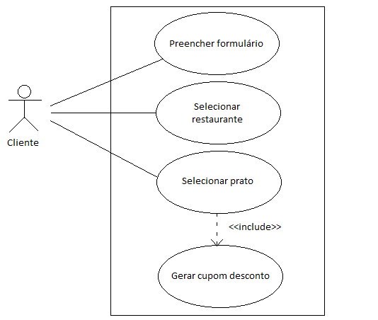

# Casos de uso

## 1. Diagrama de casos de uso

## 2. Especificação dos casos de uso

### 2.1. Caso de uso **Escolher prato**

### 2.2. Caso de uso **Escolher restaurante**

### 2.3. Caso de uso **Pegar codigo de desconto**

### 2.4. Caso de uso **Preencher formulario**

