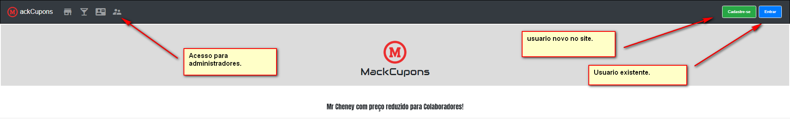
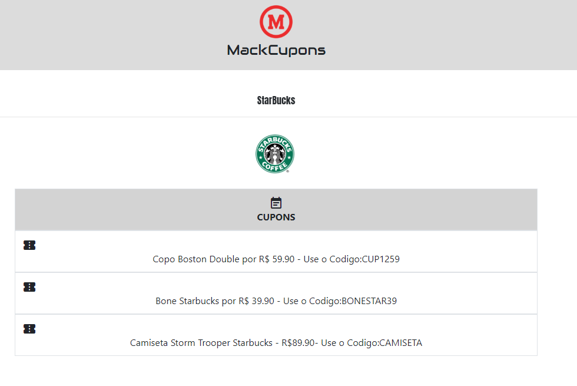
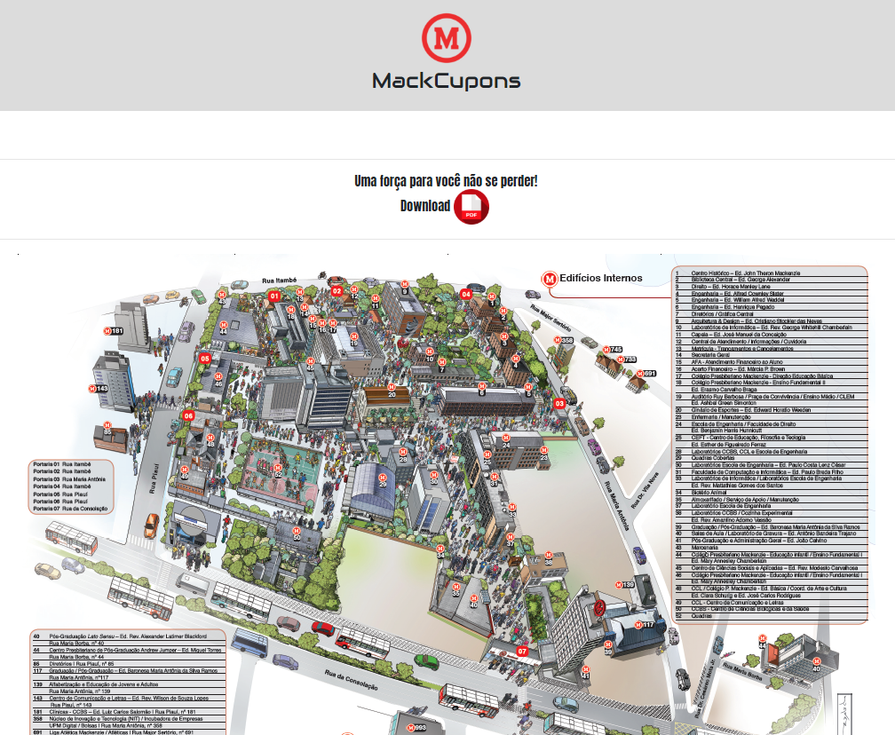
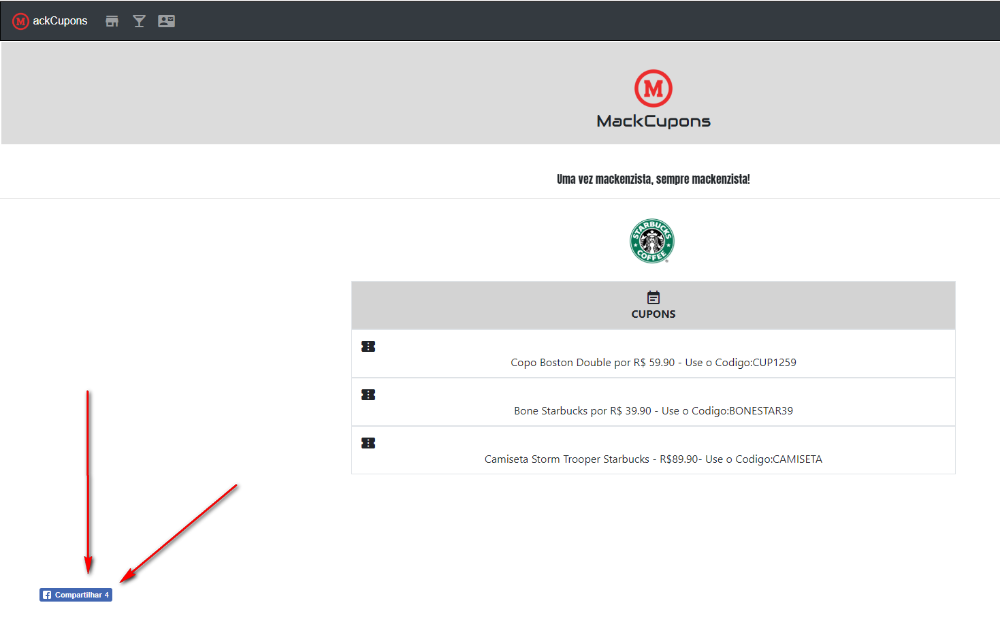
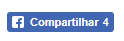
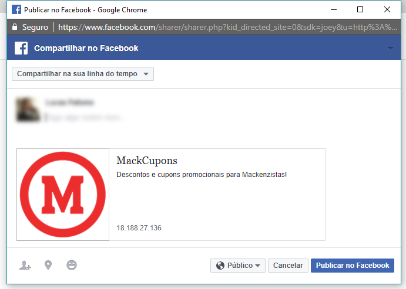
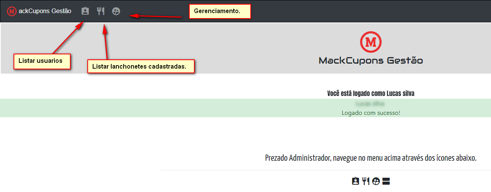
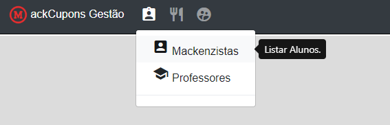
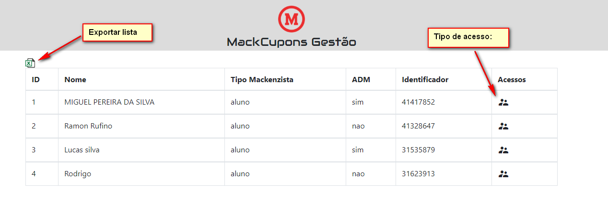

# Plano de testes

Para cada caso de uso, elabore um **procedimento de teste** para testar o cenário principal.

Em cada procedimento de teste, siga o modelo abaixo:

**Nome do caso de uso:** Fazer o cadastro no site.

**Preparação:**

* Criar no sistema um usuário com o perfil de **Aluno ou Funcionário**.
* Cadastrar 5 tarefas para o usuário criado.

**Procedimento de teste:**

| Passo | Procedimento | Resultado esperado |
| --- | --- | --- |
| 1 | Executar o navegador Chrome e acesse a URL http://18.188.27.136/mackcupons/ | Apresentação da tela de login do sistema | 
| 2 | Preencher os campos **login** e **password** com os dados de um usuário com perfil de **Aluno ou funcionario**. | Apresentação do painel do menu principal. |
| 3 | Após o login, a mensagem **Nome** logado com sucesso, seja bem vindo!. | Home page do site. |

**Nome do caso de uso:** Verificar as lanchonetes.

| Passo | Procedimento | Resultado esperado |
| --- | --- | --- |
| 4 |O usuario vai clicar no Listar "lanchonetes e Cupons", clique em algum restaurante. | Apresentação do menu com lanchonetes. | 
| 5 | Verificar qual lanchonete de seu gosto e verificar as promoções.| Apresentação da lanchonete. |
| 6 | Pegar o cupom que mais lhe agrada. | Apresentação dos cupons e codigos para oferta. |

**Nome do caso de uso:** Encontrar as lanchonetes.

| Passo | Procedimento | Resultado esperado |
| --- | --- | --- |
| 7 | Após pegar o cupom, clique em "Lanchonetes e Cupons". | Apresentação do menu com o mapa do Mackenzie. | 
| 8 | Aguardar o mapa carregar ou fazer o download do PDF.| Apresentação do mapa completo. |
| 9 | Abrir o mapa e verificar onde se encontra a lanchonete desejada. | Encontrar a lanchonete. |

**Nome do caso de uso:** Compartilhar o site com os amigos.

| Passo | Procedimento | Resultado esperado |
| --- | --- | --- |
| 10 | Após pegar o cupom, no rodapé do site, voce vai encontrar o link do Facebook para compartilhar. | Apresentação do compartilhamento. | 
|11 | Após pegar o mapa, no rodapé do site, voce vai encontrar o link do Facebook para compartilhar. | Apresentação do compartilhamento.|
| 12 | Voce vai abrir o link e será redirecionado para o Facebook, só curtir a página para saber das novidades |  |

Página de compartilhamento do Facebook:

**Nome do caso de uso:** Adicionar cupons -  Modo administrador.

| Passo | Procedimento | Resultado esperado |
| --- | --- | --- |
| 10 | Após o acesso normal, seu acesso pode ser tornado administrador, com isso voce consegue acessar o site de outro modo.  | Apresentação do local. | 
|11 | Após acessar como administrador, voce vai clicar em "Mackenzistas" e após isso em "listar alunos". | Apresentação do do local.|

| 12 | Vai abrir o local em que voce consgue exportar os usuarios do site e consegue alterar o login de comum para administrador |  |

